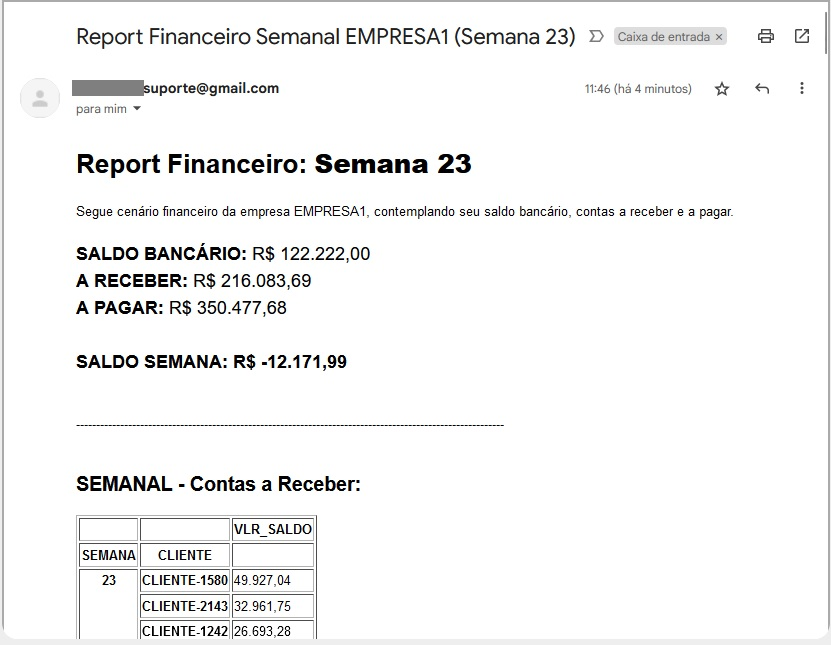
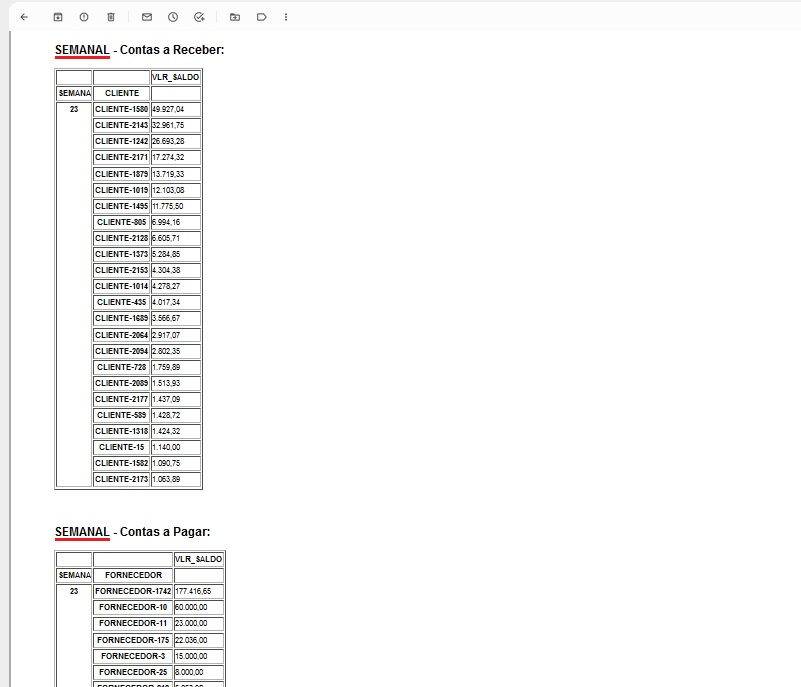
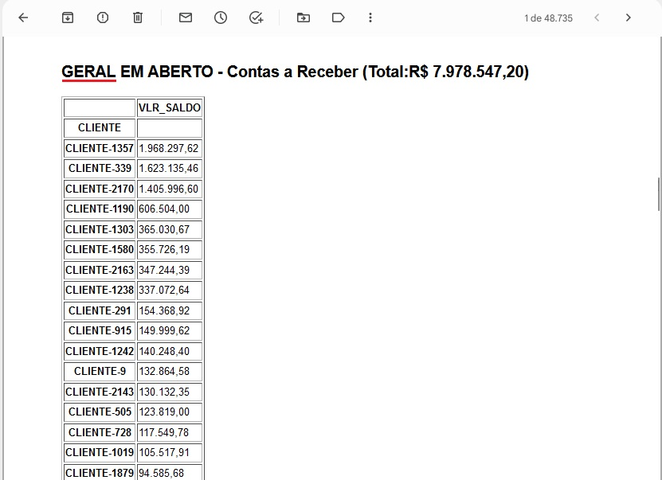
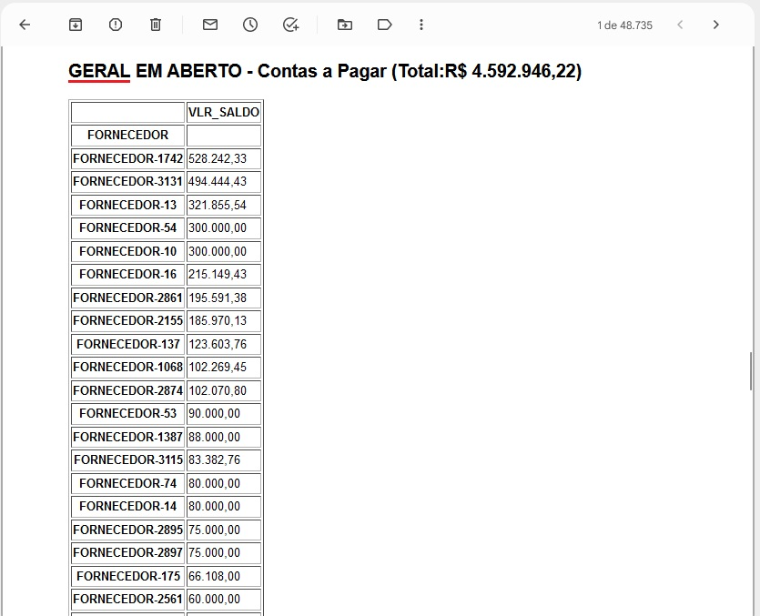

# Protheus Fin Report
> **Python | SQL** :white_check_mark: 

## Motivation
There was a need for a financial report with data coming from the **ERP Protheus of TOTVS®** that included accounts payable, receivable and the bank balance and sent via email.
Also due to the organization's needs, the total bank balance would be reported weekly in a spreadsheet, so that other balances could be entered as necessary and the report would show two views, one weekly and the other general with 60 days ahead (configurable).

## Demo Report

Header showing summaries for the current week.

Summary of the week with accumulated value by Customer (receivable) and Supplier (payable)

Accumulated overall from 60 days.

## Installation
* install requirements.txt;
* create queries in your database;
* adjusts company name and analise the need for UNION in queries;
* sets the bank variables in the py file in the "CRIA VARIÁVEIS" session;
* sets the variables in the "CONFIGURANDO ENVIO DE EMAILS" section in the py file;
* sets in the py file the directory of the xlsx file in the session "CRIANDO DATAFRAME SALDOS BANCÁRIOS"

---

## Motivação 
Necessidade de um relatório financeiro com os dados do **ERP Protheus da TOTVS®** que contemplasse o contas a pagar, a receber e o saldo bancário e fosse enviado via e-mail.
Também por necessidade da organização, o saldo bancário total seria informado semanalmente em uma planilha, para que conseguissem inputar outros saldos que se fizessem necessários e o relatório demonstraria duas visões, uma semanal e outra geral com 60 dias a frente (configurável).

## Demo Relatório

Cabeçalho demonstrando os resumos para a semana vigente.

Resumo da semana com valor acumulado por Cliente (receber) e Fornecedor (pagar)

Geral acumulado (60 dias) com soma.

## Instalação
* install requeriments.txt;
* criar as queries em sua base de dados;
* ajusta nome da empresa e necessidade de UNION nas queries;
* ajusta no arquivo py as variáveis do banco na sessão "CRIA VARIÁVEIS";
* ajusta no arquivo py as variáveis na sessão "CONFIGURANDO ENVIO DE EMAILS";
* ajusta no arquivo py o diretório do arquivo xlsx na sessão "CRIANDO DATAFRAME SALDOS BANCÁRIOS"

---
